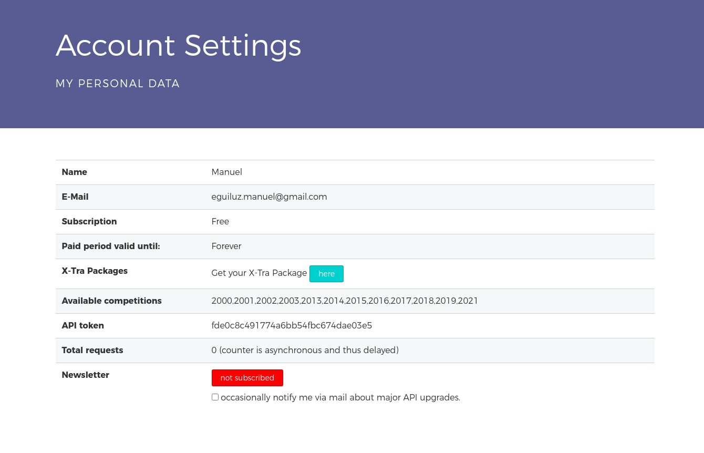

# football-league-api

API integration with [www.football-data.org](https://www.football-data.org/). \
This is a challenge in the application process to the [turbodega](https://turbodega.com/) company.

## 1. Features

- Integration with [football-data api](https://www.football-data.org/).
- List competitions
- List competition detail (Including teams and players, which are to be recorded locally).
- List teams from local.
- List team detail from local.
- List players from local.

## 2. Configuration

### API

To create an API token you need to register your email on the next [page](https://www.football-data.org/client/register) and confirm your email.



### Database

Start database with docker-compose

```(sh)
docker-compose up
```

### Environment variables

Rename file .env-local to .env \
Update variable `FOOTBALL_API_AUTH_VALUE` with your own token.

## 3. How to run

Start application

```(sh)
yarn start
```

[Postman collection](https://documenter.getpostman.com/view/1709394/TVRha8Gh#31ecaec1-6236-418d-b2bc-d59378f8a821)


## 4. Useful resources

- [Football API](www.football-data.org)
- [Postman](https://www.postman.com/)
- [Turbodega](https://turbodega.com/)
